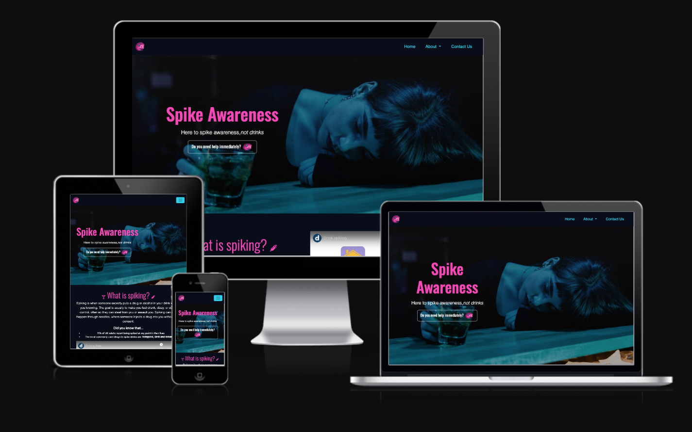

# Spike Awareness

# Overview 

Spike Awareness is my first individual project developed as part of the Code Institute AI Augmented Full Stack Software Developer Bootcamp. Spike awareness is a static website that consists of HTML, CSS & Bootstrap and it aims to provide clear, easy-to-understand information about the safeguarding issue of spiking.

The live project can found here: <a href="https://emilyhugs.github.io/Spike-awareness/" target="_blank">Live Project</a>

<h2 text-align="center" id="TOC">Table of Contents</h2>

* [Spike Awareness](#spike-awareness)
   - [Overview](#overview)
  - [Table of Contents](#TOC)
* [Project Planning](#project-planning)
    - [UX Design](#ux-design)
      - [User Stories](#user-stories)
      - [Colors](#colors)
      - [Fonts](#fonts)
      - [Imagery](#imagery)
      - [Wireframes](#wireframes)
* [Features](#features)
    - [Navigation and Hero Section](#navigation-and-hero-section)
    - [Bootstrap Cards](#bootstrap-cards)
    - [Info Section](#info-section)
    - [Footer](#footer)
    - [Modal Contact Form](#modal-contact-form)
  - [Responsive Design](#responsive-design)
* [Deployment](#deployment)
* [Testing](#testing)
* [Credits](#credits)

 ## UX Design

## User Stories 

The user stories for this project as well as their acceptance criteria and tasks can be found in the <a href="https://github.com/users/Emilyhugs/projects/6/views/1" target="_blank">project board</a>.

* As a First-Time Visitor of the page, I need easy navigation and a user-friendly design, including a responsive layout for my device, so I can find information quickly and efficiently without frustration.
* As a young adult who likes to go out, I want to know what symptoms to identify if I suspect a friend or I have been spiked so that I can take action.
* As a young adult who likes to go out, I want to know what steps to take if I suspect a friend or I have been spiked so that I can take action quickly.
* As a young adult who likes to go out, I want to know who to contact if I suspect a friend or I have been spiked so that I can get the help I need.
* As a young adult who likes to go out, I want to quickly access information on how to protect myself from drink spiking at parties and events, so that I can have fun while staying safe and be aware of the risks.
* As a victim of spiking, I want to read stories and experiences shared by other victims, so that I can feel less isolated and understand that others have gone through similar situations
* As someone who wants to know more about spiking,I want to understand what spiking is so that I can be better informed and more aware of the issue.
* As a user, I want to be informed immediately about the website's purpose with a high quality image and a clear and concise headline
* As an individual/company seeking more information, I want to contact Spike Awareness so I can ask the questions that I need to.

## Colors
The colour palette for Spike Awareness was chosen because it is bold and eye-catching, appealing to the majority of the intended users of the site young adults - see [user stories](#user-stories). I wanted to maintain the seriousness of the topic while at the same time making the site a page that young adults would actually want to engage with, especially because the primary purpose of the project is to increase their awareness of spiking and how to respond if it ever happens to them or someone else.

To ensure the colour palette was accessible, I checked with Colour Contrast Checker (also available as extension on Chrome Web Store).
I also regularly checked if the colour contrast was accessible using Dev tools in my browser.

# Fonts
As with the color palette, I also wanted the font to be visually appealing and easily readable for the users to ensure they have a positive experience visiting the website. 
For this project, I used Oswald and Roberto sans serif fonts and implemented them via [Google Fonts](https://fonts.google.com) using a direct import code within the style.css file.

# Imagery 

I wanted to select an appropriate image for the hero image that conveyed an immediate sense of what the website is about. The hero image, which I downloaded from <a href="https://www.pexels.com/" target="_blank">pexels.com</a>, inspired some of the colour choices in my colour palette too. 

I mainly relied on [Font-Awesome](https://fontawesome.com/) icons so I didn't include many pictures in this project but I would like to encorporate more in future developments. 

However, I used [Canva](https://www.canva.com/) to generate the logo for my website which is incorporated into my design as the favicon, the navbar, and the call to action button. The colours are also used as part of the colour palette for the website. 

I chose to feature a hedgehog as a logo because it visually lends itself to the theme of spiking. Furthermore, Animal logos are seen everywhere and are easily recognisable making them ideal for branding on products/social media. In particular, I was inspired by the branding and overall design style of [Octopus](https://octopus.energy/). 

# Wireframes

The wireframes for this project have been created using [Balsamiq](https://balsamiq.com/). They show the key features that guided me in creating my website, ensuring responsiveness across different screen sizes. 

**Mobile Wireframe**

**Tablet Wireframe**

**Desktop Wireframes**

## Features

# Navigation and Hero Section

I chose to use a bold and welcoming hero section for the start of the page because it quickly lets the user know what the website is about and is visually appealing.

Within this section I have included a headline, a tagline, and a button that gives users the option to easily nagivate to the relevant section of the page.

The navigation bar is a Bootstrap component and it allows for easy navigation around. I encorporated the logo in the navbar for easily accessible branding.

## Info Section 

The information section provides important information about the spiking. This section means that any user can come to the site and understand what spiking is easily.

I also embedded a youtube video explaining what spiking is, breaking up the page and providing an alternative option to cater for those who find it easier to digest audio/non-static visual imagery. It's also a good way to engage my target audience as young adults make up a large amount of social media users. 

## Bootstrap Cards
I used Bootstrap cards for the sections listing the symptoms of spiking and the action steps for if someone has been spiked. The formatting is good for displaying bitesize chunks of information which is easily digestible.

## Footer

The footer is stuck to the bottom of the site and only visible when the user reaches the end of the page. It displays basic information about the website, social media icons so that the user can go to the site's social media pages. Since Spike Awareness is not a real functioning website, the links just go to the homepage of this website. 

## Modal Contact Form
Included in the footer section, there is a button which pops up a modal form allowing the user to contact us. The form includes the user's name, email address, and message. 

## Responsive Design 
For the most part, utilising the [Bootstrap Framework](https://getbootstrap.com/docs/5.3/getting-started/introduction/) allowed me to implement a responsive design fairly easily. 

However, there were some occasions where the responsiveness just wasn't quite right which required experimenting and troubleshooting, especially with the help of AI. There are still some awkward elements but the site does function responsively to different screen sizes. 

Here is what the website looks like on different screens:

## Deployment 

This [GitHub](https://github.com/) project was created using the [Code Institute Template](https://github.com/Code-Institute-Org/ci-full-template), making the project easier for me to navigate when opening within VS Code linked with the [Gitpod IDE](https://www.gitpod.io/).

Deploying fairly on is a good idea so you can regularly check if there are any bugs/obvious design flaws within a browser and test the website's responsiveness using Dev Tools.

The steps to deploy are as follows:
* Go to the Settings tab of your GitHub repo.
* On the left-hand sidebar, in the Code and automation section, select Pages.
* Make sure the source is set to 'Deploy from Branch'.
* Make sure the main branch is selected.
* Make sure the folder is set to / (root).
* Under Branch, click Save.
* Go back to the Code tab and wait a few minutes before refreshing.
* On the right-hand side in the Deployments section click on 'github-pages'.
* The latest deployed link will appear at the top of the page.

## Testing

I tested and debugged the site regularly throughout the process, mainly using Dev Tools on a broswer to quickly identify errors. 

### Validator Testing
[HTML Validation](https://validator.w3.org/)
There is still a warning, but there are no errors in HTML

[CSS Validation](https://jigsaw.w3.org/css-validator/)
No errors with CSS

### Lighthouse
Overall score of 92 in Lighthouse testing

The Best Practises score of 74 is something I would need to look at in further development of the project.

**AI Implementation and Orchestration**
Use Cases and Reflections:
Throughout this project, I utilised the GitHub Copilot extension (via external platform Visual Studio Code 3) and Chat GPT to streamline development and testing. I also used [Canva](https://www.canva.com/) to generate my logo image. This was my first time using AI tools so extensively in a coding project, and it massively sped up the process of developing, refining, and debugging.

* Development Stage:
Reflection: I'm more familiar with Chat GPT, so I mainly used this as my resource for suggestions for user stories, colour palettes, fonts and to generate some of the text on the website, refining and fine-tuning everything as I went along.
It was very helpful to be able to ask AI to generate the exact image I wanted my logo, and made it much faster and easier than trying to manually create or find a suitable image.

* Code Creation:
Reflection: As I am new to software development and can't easily and confidently produce and understand code yet, it was really helpful to have AI to ask to create code for what I wanted and to explain what some of the code's functionality was.

* Debugging:

Reflection: Debugging with Copilot was helpful, especially when it came to identifying parsing errors.
Overall Impact:
Working with AI made the process much more efficent. However, sometimes it took a while to get the right prompt to find exactly what I needed, so I learnt to write more detailed prompts and change the wording to get what I wanted.

## Future Enhancements

* Add a section informing users on how to prevent spiking. 
* Add a section to display victims' stories so that user's can feel less isolated by seeing how spiking has affected others. 
* Actually make the contact form work so that it goes to a database. 
* Make a section giving advice for venues. 
* Create social media pages for the site to link to. 
* Create a page with links to helpful resources for victims of spiking & those wanting to know more about it.

## Credits
### Code
* The initial GitHub project was built using the Code Institute template to start.
* The navigation bar,cards, buttons, and the modal form were built with Bootstrap features.
* I took inspiration from some of Code Institute's walkthrough projects. 
* I also took inspiration from previous projections shared with us, including [TheRickyroy](https://github.com/TheRickyroy/astronauts-for-autism)'s project.
* AI was used to assist with developing, creating, and debugging the website.
* Logo and colour scheme broadly inspired by [Octopus](https://octopus.energy/) energy.

### Content
* Some text content was generated using AI.
* The icons were taken from Font Awesome.
* I also researched the topic of spiking on various websites to ensure my information was accurate. 

### Media
* The hero image was downloaded from pexels.

