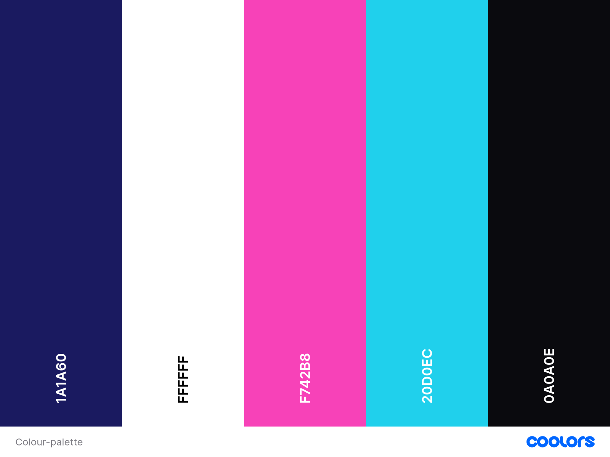
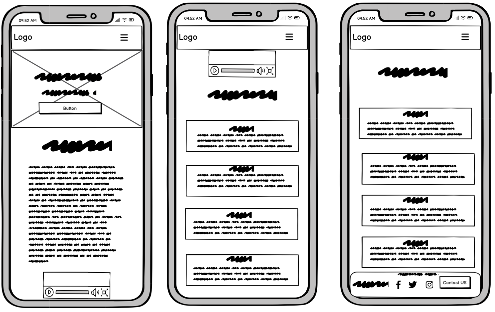
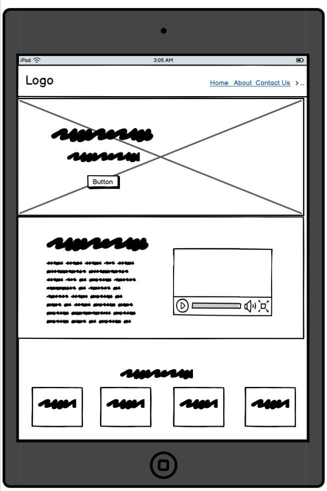
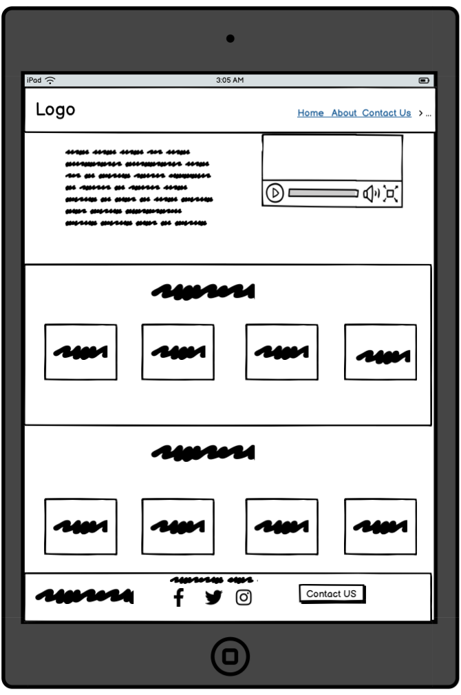
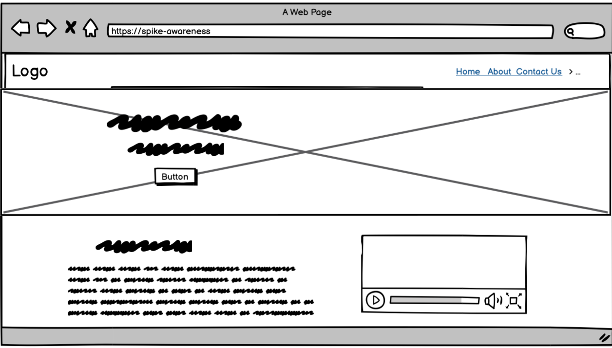
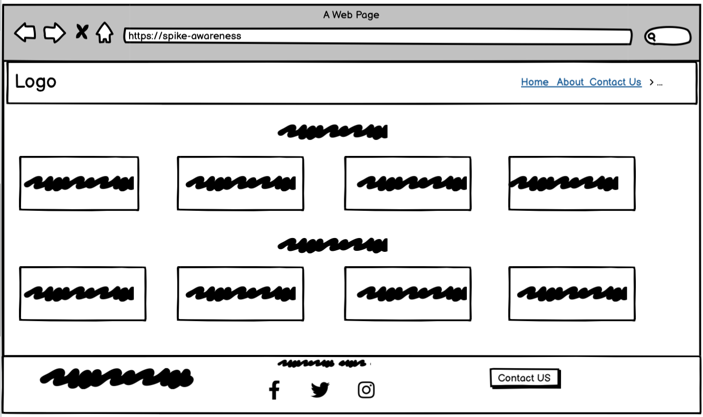
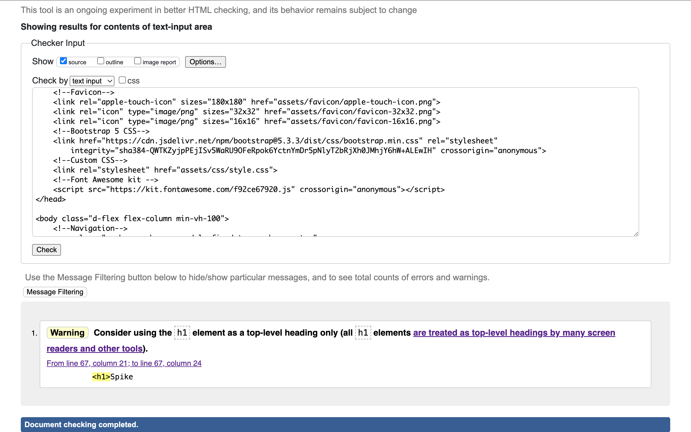
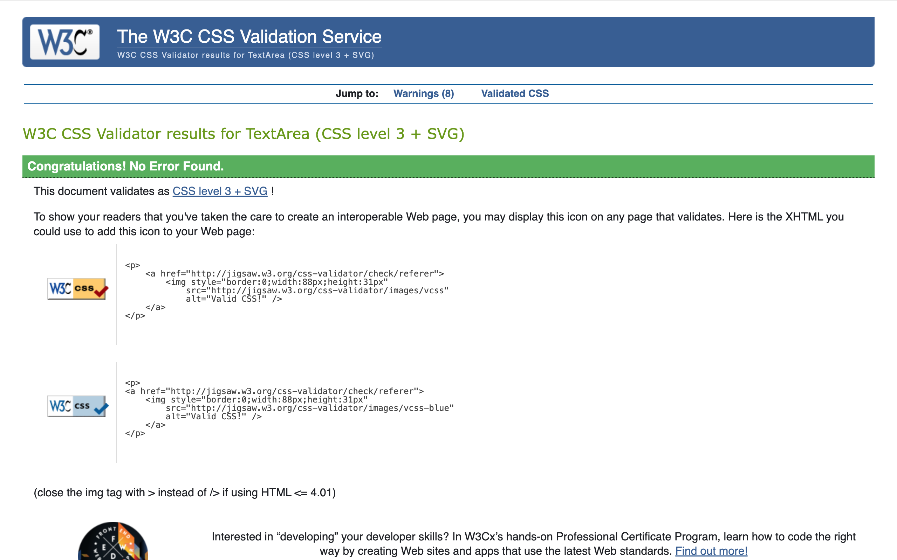
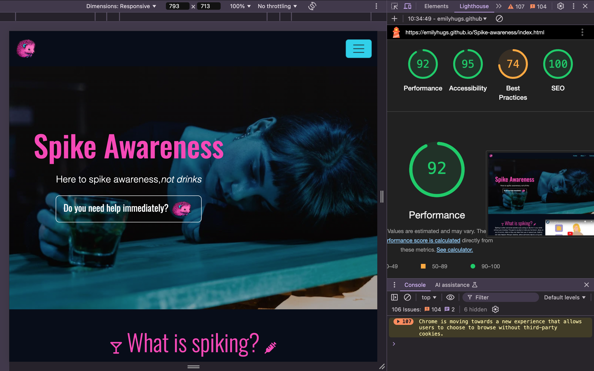

# Spike Awareness

# Overview 

Spike Awareness is my first individual project developed as part of the Code Institute AI Augmented Full Stack Software Developer Bootcamp. Spike awareness is a static website that consists of HTML, CSS & Bootstrap and it aims to provide clear, easy-to-understand information about the safeguarding issue of spiking.

The live project can found here: <a href="https://emilyhugs.github.io/Spike-awareness/" target="_blank">Live Project</a>

<h2 align="center" id="TOC">Table of Contents</h2>

* [Spike Awareness](#spike-awareness)
   - [Overview](#overview)
  - [Table of Contents](#TOC)
* [Project Planning](#project-planning)
    - [UX Design](#ux-design)
  - [User Stories](#user-stories)
   - [Colors](#colors)
   - [Fonts](#fonts)
   - [Imagery](#imagery)
   - [Wireframes](#wireframes)
* [Features](#features)
  - [General Features](#general-features)
    - [Navigation and Hero Section](#navigation-and-hero-section)
    - [Bootstrap Cards](#bootstrap-cards)
    - [Policies Section](#policies-section)
    - [Footer](#footer)
    - [Links and Buttons](#links-and-buttons)
  - [Responsive Design](#responsive-design)
* [Built With](#built-with)
  - [Technology and Languages](#technologies-and-languages)
  - [Libraries and Frameworks](#libraries-and-frameworks)
  - [Tools & Programs](#tools-and-programs)
* [Deployment](#deployment)
* [Testing](#testing)
* [Credits](#credits)
  - [Code](#code)
* [AI Implementation and Orchestration](#ai-implementation-and-orchestration)
* [Future Enhancements](#future-enhancements)
  - [Content Research](#content-research)

 ## UX Design

## User Stories 

The user stories for this project as well as their acceptance criteria and tasks can be found in the <a href="https://github.com/users/Emilyhugs/projects/6/views/1" target="_blank">project board</a>.

* As a First-Time Visitor of the page, I need easy navigation and a user-friendly design, including a responsive layout for my device, so I can find information quickly and efficiently without frustration.
* As a young adult who likes to go out, I want to know what symptoms to identify if I suspect a friend or I have been spiked so that I can take action.
* As a young adult who likes to go out, I want to know what steps to take if I suspect a friend or I have been spiked so that I can take action quickly.
* As a young adult who likes to go out, I want to know who to contact if I suspect a friend or I have been spiked so that I can get the help I need.
* As a young adult who likes to go out, I want to quickly access information on how to protect myself from drink spiking at parties and events, so that I can have fun while staying safe and be aware of the risks.
* As a victim of spiking, I want to read stories and experiences shared by other victims, so that I can feel less isolated and understand that others have gone through similar situations
* As someone who wants to know more about spiking,I want to understand what spiking is so that I can be better informed and more aware of the issue.
* As a user, I want to be informed immediately about the website's purpose with a high quality image and a clear and concise headline
* As an individual/company seeking more information, I want to contact Spike Awareness so I can ask the questions that I need to.

## Colors

The colour palette for Spike Awareness was chosen because it is bold and eyecatching, appealing to the majority of the intended users of the site (young adults - see user stories). I wanted to maintain the seriousness of the topic while at the same time making the site a page that young adults would actually want to engage with, especially because the primary purpose of the project is to increase their awareness of spiking and how to respond if it ever happens to them or someone else. 

# Wireframes

The wireframes for this project have been created using [Balsamiq](https://balsamiq.com/)

**Mobile Wireframe**

**Tablet Wireframe**

**Desktop Wireframes**

## Deployment 

This [GitHub](https://github.com/) project was created using the [Code Institute Template](https://github.com/Code-Institute-Org/ci-full-template), making the project easier for me to navigate when opening within VS Code linked with the [Gitpod IDE](https://www.gitpod.io/).

Deploying fairly on is a good idea so you can regularly check if there are any bugs/obvious design flaws within a browser and test the website's responsiveness using Dev Tools.

The steps to deploy are as follows:
* Go to the Settings tab of your GitHub repo.
* On the left-hand sidebar, in the Code and automation section, select Pages.
* Make sure the source is set to 'Deploy from Branch'.
* Make sure the main branch is selected.
* Make sure the folder is set to / (root).
* Under Branch, click Save.
* Go back to the Code tab and wait a few minutes before refreshing.
* On the right-hand side in the Deployments section click on 'github-pages'.
* The latest deployed link will appear at the top of the page.

## Testing

I tested and debugged the site regularly throughout the process, mainly using Dev Tools on a broswer to quickly identify errors. 

### Validator Testing
There is still a warning, but there are no errors in HTML

No errors with CSS

### Lighthouse
Overall score of 92 in Lighthouse testing

The Best Practises score of 74 is something I would need to look at in further development of the project.

## AI Implementation and Orchestration

### Use Cases and Reflections:

Throughout this project, I utilised the GitHub Copilot extension (via external platform Visual Studio Code 3) and Chat GPT to streamline development and testing. I also used [Canva](https://www.canva.com/) to generate my logo image. This was my first time using AI tools so extensively in a coding project, and it massively sped up the process of developing, refining, and debugging.

- **Development Stage:** 
  - Reflection: I'm more familiar with Chat GPT, so I mainly used this as my resource for suggestions for user stories, colour palettes, fonts and to generate some of the text on the website, refining and fine-tuning everything as I went along.
  - It was very helpful to be able to ask AI to generate the exact image I wanted my logo, and made it much faster and easier than trying to manually create or find a suitable image. 

- **Code Creation:** 
  - Reflection: As I am new to software development and can't easily and confidently produce and understand code yet, it was really helpful to have AI to ask to create code for what I wanted and to explain what some of the code's functionality was.

- **Debugging:** 
  - Reflection: Debugging with Copilot was helpful, especially when it came to identifying parsing errors. 

### Overall Impact:
Working with AI transformed my workflow. It allowed me to focus on higher-level decisions while handling repetitive tasks efficiently. However, it wasn’t always perfect—some suggestions required significant tweaking to fit my specific needs. Those moments were valuable reminders that the AI wasn’t a replacement for my skills but a tool to enhance them. 

Looking back, I feel this experience not only improved my technical abilities but also my problem-solving skills. It pushed me to articulate my ideas clearly (both to the AI and myself) and made me more mindful of inclusivity and accessibility in software design. Above all, it taught me the importance of embracing new technologies as partners in the creative process.

## Future Enhancements
-Add a section informing users on how to prevent spiking.
-Add a section to display victims' stories so that user's can feel less isolated by seeing how spiking has affected others.
-Actually make the contact form work so that it goes to a database.
-Make a section giving advice for venues.
-Create social media pages for the site to link to.
-Create a page with links to helpful resources for victims of spiking & those wanting to know more about it.
- Build multilingual support for non-English-speaking users so that people can become aware of spiking as a safeguarding issue. 
- Add images to the cards to make the website more visually appealing.
- Add a modal which allows user's to quickly share the page amongst friends/follows on social media. 

Table of contents
Project Outline
Project Planning 
UX Design 
User Stories
Colours
Fonts
Wireframes

Features
Navigation 
Hero Section 
Bootstrap Cards
Footer

